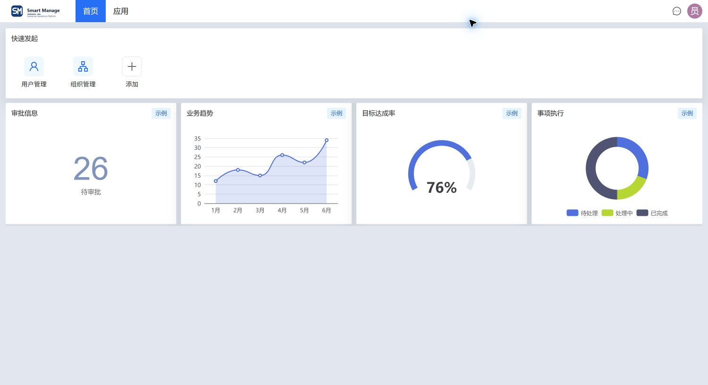
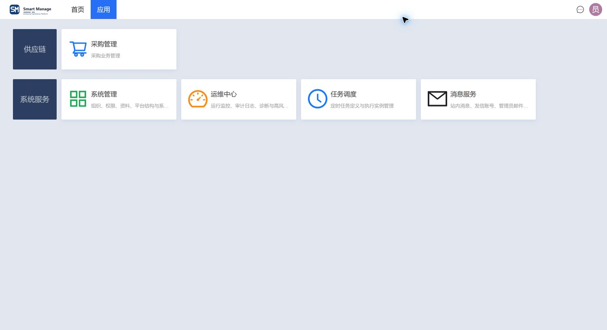
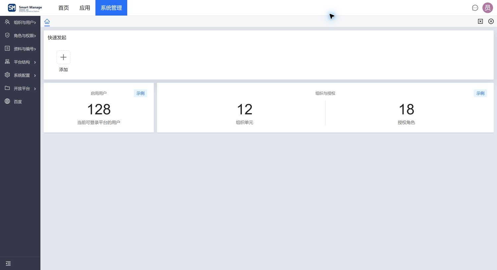
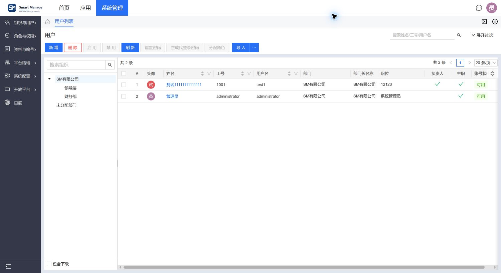
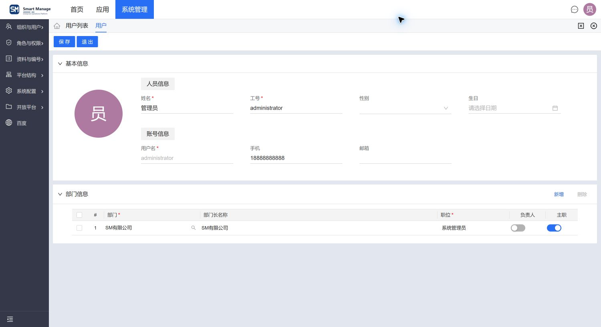

# Smart Manage

Smart Manage 是一个基于 Spring Boot 4、React 19 和 Ant Design
构建的企业级中后台系统底座。项目围绕多应用工作台、组织权限、系统配置、消息服务、任务调度与运行监控等通用能力展开，为企业管理应用提供统一、可扩展的基础能力。

## 界面预览

| 登录界面                                                 | 系统首页                                                       |
|----------------------------------------------------------|----------------------------------------------------------------|
|  |  |

| 应用总览                                                        | 系统管理应用首页                                                     |
|-----------------------------------------------------------------|----------------------------------------------------------------------|
|  |  |

| 用户列表                                            | 用户编辑                                            |
|-----------------------------------------------------|-----------------------------------------------------|
|  |  |

## 核心功能

- **统一工作台**：提供系统首页、应用入口、应用级首页、快捷发起、多应用页签和内容页签，支持列表、新增、编辑、查看等页面在同一工作区内协作。
- **组织与用户**：维护组织树、用户及任职关系，支持账号启停、密码重置、角色分配、用户导入和受控的代登录能力。
- **角色与权限**：以功能、菜单和后端权限为边界配置角色授权，并支持组织范围和对象级数据权限。
- **基础资料与平台配置**：覆盖基础资料、编码规则、应用、菜单、功能、权限、界面配置、系统参数、附件与存储配置等平台能力。
- **消息与邮件**：提供站内消息收件箱、全站消息发布、邮件账号管理、管理员投递和发送记录查询。
- **任务调度**：管理定时任务定义、启停与触发，并跟踪执行实例、结果和错误信息。
- **运行监控与审计**：覆盖运行指标、缓存与 Redis、慢 SQL、线程诊断、登录日志、操作日志、告警，以及受权限保护的脚本和 SQL 运维入口。
- **模块化扩展**：通过统一的列表、编辑、分配、引用选择、附件和数据交换能力支撑业务模块扩展，同时保持领域状态与业务规则的独立边界。
- **数据交换与开放能力**：提供通用导入、导出与结果制品处理，并通过 OpenAPI 应用和请求签名支持受控的系统集成。

## 架构特点

- 前后端分离，后端按业务领域组织模块，前端采用应用工作台与白名单页面注册机制。
- 功能、菜单、页面和权限使用稳定业务键关联，前端权限负责交互控制，后端始终作为最终鉴权边界。
- 数据库结构及必要初始化数据由所属 Maven 模块的 Flyway 迁移管理，平台与可选领域使用独立历史表；升级约束见[数据库开发](docs/development/database.md)。
- 通用列表、编辑、分配、引用选择、附件和数据交换能力沉淀为共享页面框架，业务模块保留自身状态与规则。
- 使用自动化测试、架构测试、静态检查和真实 PostgreSQL 验证保护模块边界、权限、事务与迁移行为。

## 技术栈

| 层级 | 技术 |
| --- | --- |
| 后端 | Java 21、Spring Boot 4、MyBatis-Plus、PostgreSQL、Redis、Sa-Token、Flyway、Druid |
| 前端 | React 19、TypeScript、Vite、Ant Design 6、TanStack Query、Zustand |

## 项目结构

```text
smart-manage/
├── pom.xml             # 父 POM，默认装配平台
├── platform/           # 平台普通 JAR，含 system/infrastructure/domain.sys 及平台迁移
├── bootstrap/          # 启动入口、配置和最终可执行 JAR
├── domains/demo/       # 可选演示领域，含采购样板代码、迁移、测试和文档
├── dev-support/fixtures/ # 显式导入的开发数据，不进入自动迁移
├── db/                 # 空库验证脚本
├── docs/               # 平台架构和开发规范
└── smart-manage-web/    # 一个前端工程，构建时选择领域
```

## 快速开始

### 环境要求

- JDK 21
- Maven 3.9+
- Node.js 22+
- pnpm 11+
- PostgreSQL 16+
- Redis

### 1. 创建数据库

```sql
CREATE DATABASE smart_manage;
```

默认开发配置使用 `postgres/postgres` 连接本机 `smart_manage` 数据库，仅用于本地开发。

### 2. 启动后端

首次启动前通过外部配置提供管理员临时初始密码，见下方说明。以下命令在仓库根目录执行。

```bash
mvn package
java -jar bootstrap/target/smart-manage-bootstrap.jar
```

后端默认地址为 `http://localhost:8080/smart-manage-api`，同时提供以下接口文档：

- Swagger UI：`http://localhost:8080/smart-manage-api/swagger-ui.html`
- Scalar：`http://localhost:8080/smart-manage-api/scalar`

### 3. 启动前端

```bash
cd smart-manage-web
pnpm install
pnpm dev
```

前端默认地址为 `http://localhost:8000`，开发服务器会将 `/smart-manage-api` 代理到后端。

自定义 API 前缀时，通过后端 `server.servlet.context-path` 和前端 `VITE_API_BASE_PATH` 配置，部署侧同步代理与内部地址；详见 [修改 API context path](./docs/development/configuration.md#修改-api-context-path)。

所有环境首次安装都必须从外部配置提供 `SMART_MANAGE_INITIAL_ADMINISTRATOR_PASSWORD`，符合统一密码策略；账号为 `administrator`，首次登录强制改密。初始化完成后可移除临时配置，重启不会覆盖密码。没有公开的可用管理员初始密码。完整配置说明见[环境与配置](./docs/development/configuration.md)。

## 可选演示领域

`demo`（演示）是可选业务样板集合，目前以采购申请展示真实业务模块的开发方式，不代表完整供应链产品；自动化测试仍位于 `src/test`。默认后端和前端只交付平台。需要演示样板时，在根目录使用 `mvn -Pwith-demo package`；前端构建或开发时设置 `SMART_MANAGE_DOMAINS=sys,demo` 后执行原有 `pnpm build` 或 `pnpm dev`。两端由维护者选择同一领域组合。

后端选入 DEMO 后执行它自己的迁移，只包含结构和必要目录数据，不自动导入演示记录。前端应用首页与业务页面分别懒加载，仍一次构建、统一部署。

不需要采购的衍生项目可删除 `domains/demo` 和 `smart-manage-web/src/domain/demo`，默认装配仍可构建；显式选择不存在的领域会失败。删除源码不等于卸载已初始化数据库中的表或数据。本次调整针对未发布基线，不提供旧开发库自动升级或清理。

## 质量验证

后端测试：

```bash
mvn test
```

前端检查：

```bash
cd smart-manage-web
pnpm lint
pnpm format:check
pnpm test
pnpm build
```

以上命令是代码修改的快速验证入口。按改动类型执行的完整门槛、组件注册表检查及真实 PostgreSQL
验证见[质量验证](./docs/development/verification.md#按改动类型选择验证)。纯文档修改不要求执行前后端构建和测试。

## 文档导航

- [文档总览](./docs/README.md)
- [架构概览](./docs/architecture/overview.md)
- [模块开发指南](./docs/development/module-development-guide.md)
- [开发与贡献](./CONTRIBUTING.md)
- [项目路线图](./docs/roadmap.md)

AI 编码代理还必须遵循根目录及对应子项目中的 `AGENTS.md`。

## 安全说明

- 开发配置中的默认密码和密钥均为公开配置，不得用于生产环境。
- 生产环境必须启用 `prod` Profile，并通过环境变量提供敏感配置。
- 前端权限只控制界面能力，后端始终是最终鉴权边界。
- SQL、脚本、诊断和代登录等高风险能力还会校验对应权限或超级管理员身份。

## 许可证

本项目基于 [Apache License 2.0](./LICENSE) 开源。
